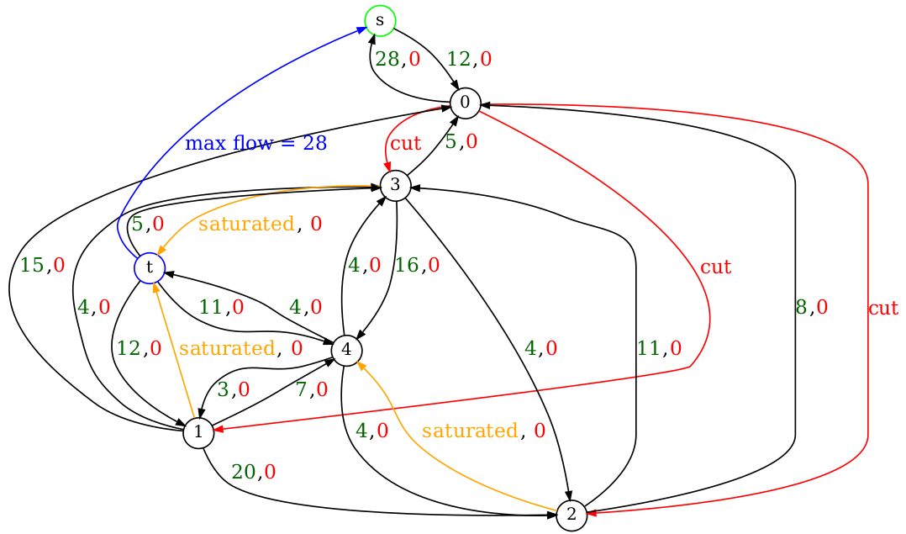

# Introduction

## Problème de flot maximum
Le problème de flot maximum consiste à trouver, dans un réseau de flot, un flot réalisable depuis une source unique et vers un puits unique qui soit maximum.

## Problème du flot de coût minimum

Le problème du flot de coût minimum est similaire au flot maximum sauf qu'il faut emprunter coût le plus minimal possible.

# Flot maximum

    Pour résoudre le problème du flot maximum nous allons utiliser l'algorithme de Ford-Fulkerson. Le principe est le suivant: Tant qu'il existe un chemin entre la source et le puits dans le graphe résiduel, il faut envoyer le minimum des capacités résiduelles sur ce chemin.

    Dans l'algo, dans un premier temps l'utilisation de BFS est nécessaire pour savoir s'il existe un chemin de s à t et ainsi faire les opérations sur les arêtes pour les mettre à jour. Si un chemin existe alors nous cherchons le flot minimum de t à s dans le chemin que nous avons trouvé.
    Une fois trouvé, ce flot est ajouté au flot maximum.
    Une deuxième passe de t à s est nécessaire pour mettre à jour les flots et cela va provoquer la saturation de certaines arêtes.

    Dans le graphe généré par mon programme ci-dessous nous pouvons voir un exemple applicatif de l'algo qui tourne du nœud 0 au nœud 6. Par soucis de structure de donnés mon programme n'acceptant pas l'alphabet mais n'utilisant que les indices j'ai donc dû faire en sorte d'ajouter deux nœuds, 0 et 6 qui seront au final s et t.

# Flot maximum de coût minimum

Pour le problème du flot de coût minimum le principe est presque le même, à la place d'utiliser BFS nous utilisons un algorithme de plus court chemin nommé Bellman-Ford qui permet de détecter les cycles négatifs et gérer les coûts négatifs.
Le principe est le suivant: tant qu'il existe un plus court chemin de s à t, on cherche le flot minimum du chemin et nous l'ajoutons au flot maximum. Ensuite, nous mettons à jour les capacités de flot et nous rajoutons le coût de l'arête fois le flot minimal du plus court chemin actuel.

# Coupe minimum

    Une coupe minimum d'un graphe est un ensemble de sommets contenant un nombre minimal d'arêtes.
    Lors du déroulement des algos de flot maximum nous allons ajouter dans une liste toutes les arêtes qui sont saturés pour ensuite pouvoir déterminer la coupe minimum.

    Pour trouver la coupe minimum d'un graphe il va falloir chercher parmi nos arcs saturés s'il existe un chemin de s à u et s'il n'existe pas de chemin de s à v, si cette condition est validé alors cet arc fait partie de la coupe minimum. L'algo procède comme suit: on vérfie chaque arête (u, v) qui ont été saturés  et si BFS(s, u) trouve un chemin de s à u et qu'il n'existe pas de chemin BFS(s, v) de s à v alors cet arc fait partie de la coupe minmum.